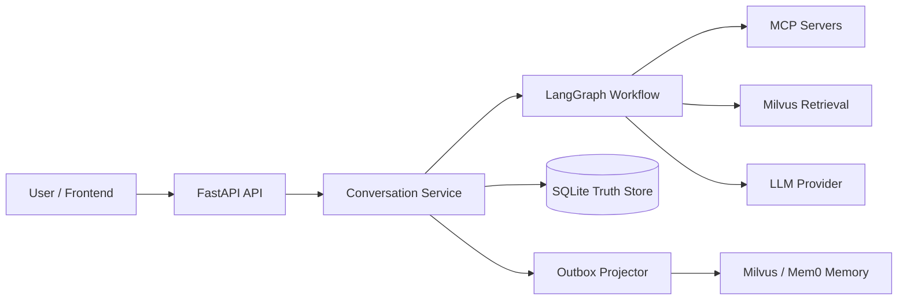

# Crypto Signal Agent

> 对话优先的加密研究 Agent：整合 MCP 多源信号、记忆系统与可追溯报告版本。


基于 `LangChain + LangGraph + MCP + Milvus + Mem0` 构建，面向“信号采集 -> 研报生成 -> 持续对话 -> 分支回放”的完整链路。

## 目录

- [Crypto Signal Agent](#crypto-signal-agent)
  - [目录](#目录)
  - [为什么选择它](#为什么选择它)
  - [核心能力](#核心能力)
  - [系统架构](#系统架构)
  - [快速开始](#快速开始)
    - [1) 环境准备](#1-环境准备)
    - [2) 安装依赖](#2-安装依赖)
    - [3) 配置环境变量](#3-配置环境变量)
    - [4) 初始化 Milvus（可选但推荐）](#4-初始化-milvus可选但推荐)
    - [5) 验证 MCP 可用性（推荐）](#5-验证-mcp-可用性推荐)
    - [6) 启动后端](#6-启动后端)
    - [7) 启动前端](#7-启动前端)
  - [配置说明](#配置说明)
  - [MCP 配置示例](#mcp-配置示例)
  - [API 快速体验](#api-快速体验)
    - [1) 生成首版研报](#1-生成首版研报)
    - [2) 基于当前会话继续追问](#2-基于当前会话继续追问)
    - [3) 查看报告版本历史](#3-查看报告版本历史)
  - [前端控制台](#前端控制台)
  - [开发与测试](#开发与测试)
  - [项目结构](#项目结构)
  - [常见问题](#常见问题)
  - [许可证](#许可证)
  - [风险声明](#风险声明)

## 为什么选择它

- **对话优先**：统一入口支持 `auto/chat/rewrite_report/regenerate_report`。
- **可追溯**：会话与报告版本可回放，支持从历史 `turn` 分支恢复。
- **多源信号**：通过标准 MCP 协议接入行情、链上、新闻等数据。
- **工程化可观测**：请求级 `X-Trace-Id`、节点级耗时、重试与降级策略。

## 核心能力

- MCP 多服务工具发现与调用（`langchain-mcp-adapters`）
- LangGraph 编排研究流程，输出 `workflow_steps`
- Milvus 向量检索与长期记忆（Mem0 可选）
- 会话一致性保障：`request_id` 幂等 + `expected_version` CAS
- 异步 outbox 投影：会话真相库强一致、外部记忆最终一致

## 系统架构



详细架构说明见：[`docs/architecture.md`](docs/architecture.md)

## 快速开始

### 1) 环境准备

- Python `3.12+`
- [uv](https://docs.astral.sh/uv/)
- Node.js `18+`（前端需要）
- 可选：Milvus、Redis

### 2) 安装依赖

```bash
# 后端
uv sync

# 前端
npm --prefix frontend install
```

### 3) 配置环境变量

```bash
cp .env.example .env
```

最少请配置：

- `LLM_PROVIDER` + 对应密钥（默认 MiniMax）
- `MCP_CONFIG_PATH` 指向 `.mcp.json`
- 若启用向量库：`MILVUS_URI`

### 4) 初始化 Milvus（可选但推荐）

```bash
uv run python scripts/init_milvus.py
```

### 5) 验证 MCP 可用性（推荐）

```bash
uv run python scripts/verify_mcp_servers.py
```

### 6) 启动后端

```bash
uv run python main.py
```

启动后访问：<http://127.0.0.1:8000/docs>

### 7) 启动前端

```bash
npm --prefix frontend run dev
```

默认地址：<http://127.0.0.1:5173>

## 配置说明

完整变量请参考 [`.env.example`](.env.example)。

常用项：

| 分类 | 变量 | 说明 |
|---|---|---|
| 服务 | `APP_HOST` / `APP_PORT` | API 服务监听地址 |
| LLM | `LLM_PROVIDER` / `LLM_MODEL` | 模型供应商与模型名 |
| Embedding | `EMBEDDING_PROVIDER` / `ZHIPU_EMBEDDING_MODEL` | 向量化配置 |
| Milvus | `MILVUS_URI` / `VECTOR_DIM` | 向量库连接与维度 |
| 会话 | `CONVERSATION_STORE_PATH` | SQLite 真相库存储路径 |
| Session | `SESSION_STORE_BACKEND` / `REDIS_URL` | 短期会话记忆存储 |
| MCP | `MCP_CONFIG_PATH` / `MCP_MAX_ROUNDS` | MCP 配置与调用预算 |

## MCP 配置示例

项目默认读取根目录 `.mcp.json`：

```json
{
  "mcpServers": {
    "coingecko": {
      "type": "http",
      "url": "https://mcp.api.coingecko.com/mcp"
    },
    "defillama": {
      "type": "http",
      "url": "https://mcpllama.com/mcp"
    },
    "cryptonews": {
      "type": "stdio",
      "command": "uv",
      "args": ["run", "crypto-news-mcp"],
      "cwd": "/path/to/cryptoNewsMCP",
      "env": {
        "CRYPTOPANIC_AUTH_TOKEN": "${CRYPTOPANIC_AUTH_TOKEN}"
      }
    }
  }
}
```

## API 快速体验

### 1) 生成首版研报

```bash
curl -X POST http://127.0.0.1:8000/v1/conversation/conv-u001/message \
  -H "Content-Type: application/json" \
  -d '{
    "user_id": "u001",
    "message": "请给我 BTC 和 ETH 的 24 小时风险信号研报",
    "action": "regenerate_report",
    "task_context": {"symbols": ["BTC", "ETH"]},
    "request_id": "req-u001-turn1"
  }'
```

### 2) 基于当前会话继续追问

```bash
curl -X POST http://127.0.0.1:8000/v1/conversation/conv-u001/message \
  -H "Content-Type: application/json" \
  -d '{
    "user_id": "u001",
    "message": "请解释这版报告里最关键的下行风险",
    "action": "chat",
    "expected_version": 1,
    "request_id": "req-u001-turn2"
  }'
```

### 3) 查看报告版本历史

```bash
curl "http://127.0.0.1:8000/v1/conversation/conv-u001/reports?limit=20"
```

更多接口请查看 OpenAPI 文档或 [`app/api/routes.py`](app/api/routes.py)。

## 前端控制台

前端位于 `frontend/`，技术栈：`React + Vite + TypeScript + TanStack Query + Zustand`。

- Message Composer：支持 `chat/rewrite/regenerate/auto`
- Dialogue：连续对话流
- Timeline + Branch Tree：按 `parent_turn_id` 回放分支
- Version Tape：报告版本选择与回放

UI 联调辅助：

```bash
# 无头模式（自动截图+日志）
npm --prefix frontend run ui:debug

# 有头模式
npm --prefix frontend run ui:debug:live
```

## 开发与测试

```bash
# 后端单测（示例）
uv run python -m unittest tests/test_api.py

# 可选：MCP 原始响应巡检
uv run python scripts/inspect_mcp.py
```

## 项目结构

```text
.
├── app/                  # 后端核心代码
│   ├── api/              # HTTP 路由
│   ├── agents/           # LLM 代理与报告生成
│   ├── config/           # 配置与日志
│   ├── conversation/     # 会话真相库/幂等/CAS/outbox
│   ├── graph/            # LangGraph 工作流与 MCP 子图
│   ├── memory/           # 会话/长期记忆服务
│   ├── models/           # 数据模型
│   └── retrieval/        # 向量检索与入库
├── frontend/             # React 控制台
├── scripts/              # 初始化与诊断脚本
├── tests/                # 测试用例
├── docs/                 # 设计与架构文档
└── main.py               # 启动入口
```

## 常见问题

- **Q: 没配置 Milvus 能跑吗？**  
  A: 可以，按配置可降级为内存模式（生产仍建议启用 Milvus）。

- **Q: LLM 不可用时会怎样？**  
  A: `/v1/research/query` 与 `/v1/conversation/{conversation_id}/message` 会返回 500（硬失败）。

- **Q: `from_turn_id` 的作用？**  
  A: 作为分支锚点，后续上下文仅基于该分支链路构建。

## 许可证

本项目采用 [MIT License](LICENSE)。

## 风险声明

本项目输出仅用于研究与信息参考，不构成任何投资建议。
