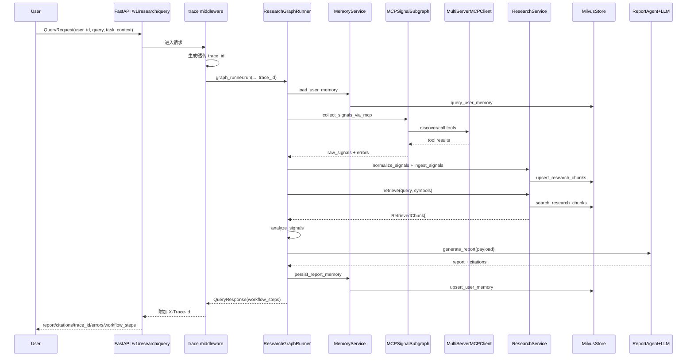

# 工程架构梳理

- 当前梳理时间: 2026-03-03 11:27:02

## 项目概览
- 项目定位: 面向加密市场研究场景的研报 Agent，聚焦“信号采集 -> 标准化 -> 检索增强 -> 个性化报告生成”。
- 主要能力:
  - 基于标准 MCP 协议采集多源市场信号（`streamable_http` / `stdio` / `sse`），由官方 `langchain-mcp-adapters` 驱动。
  - 基于 LangGraph 编排“主流程 9 节点 + MCP 子图 9 节点”，并输出节点级真实耗时 `workflow_steps`。
  - MCP 子图采用“LLM 规划 raw calls + 规则引擎过滤 + 多轮判停”，可在失败场景下自动收敛。
  - 基于 Milvus 存储研究语料与用户记忆，支持向量检索与重排。
  - 基于 Mem0（可选，platform/oss 两种模式）+ 本地会话记忆形成长期/短期记忆画像。
  - LLM 客户端可配置替换（当前默认 MiniMax，走 OpenAI-compatible 协议）。
  - 提供 React 控制台前端，支持研报执行、记忆管理、手动入库、运行时状态查看。
- 关键输出:
  - `POST /v1/research/query` 返回 `report`、`citations`、`trace_id`、`errors`、`workflow_steps`。
  - `POST /v1/research/ingest` 支持外部文档回填为检索语料。
  - `POST /v1/user/preferences` / `GET /v1/user/profile/{user_id}` 支持偏好写入与画像读取。
  - 所有请求通过中间件注入/透传 `X-Trace-Id` 响应头，便于端到端排障。

## 工程逻辑梳理

### 入口与启动
- 入口文件/命令:
  - 后端启动命令：`uv run python main.py`
  - 后端启动脚本：`main.py`，内部调用 `uvicorn.run("app.main:app", ...)`
  - FastAPI 应用入口：`app/main.py`
  - 前端启动命令：`npm --prefix frontend run dev`
  - 前端入口：`frontend/src/main.tsx`（`QueryClientProvider + BrowserRouter`）
- 启动流程概述:
  1. `main.py` 加载全局配置 `settings` 并启动 Uvicorn。
  2. FastAPI `lifespan` 中执行日志初始化 `setup_logging`。
  3. 构建 `AppRuntime`（`app/runtime.py`）统一装配依赖。
  4. `AppRuntime` 依次初始化：LangSmith、MilvusStore、LLM Client、MemoryService、MCPSignalSubgraphRunner、ResearchService、ReportAgent、ResearchGraphRunner。
  5. 请求进入后由 `trace_logging_middleware` 生成或透传 `X-Trace-Id`，记录请求开始/结束日志。
  6. `collect_signals_via_mcp` 节点调用 `MCPSignalSubgraphRunner` 完成多轮 MCP 采集。
  7. 应用关闭时执行 `runtime.close()`，释放 Milvus 连接。

### 核心模块
- 模块划分:
  - `app/api`: HTTP 路由与依赖注入。
  - `app/graph`: LangGraph 主流程（`workflow.py`）与 MCP 子图（`mcp_subgraph.py`）。
  - `app/retrieval`: Embedding、Milvus 存储封装、信号入库与检索服务。
  - `app/memory`: 记忆服务（Mem0 优先，Milvus + Session 降级）。
  - `app/agents`: LLM 抽象、客户端工厂、研报生成代理。
  - `app/config`: 环境变量配置与日志配置（trace 上下文注入、按天+按大小轮转）。
  - `app/observability`: LangSmith 跟踪配置。
  - `app/models`: API 协议、内部信号模型、LangGraph State。
  - `frontend`: React 控制台（Dashboard / Memory / Ingest / Settings）。
  - `scripts`: 运维初始化、MCP 可用性验证与 MCP 原始响应巡检脚本。
- 关键职责:
  - `app/main.py`: 应用创建、生命周期管理、请求级 trace middleware。
  - `app/runtime.py`: 统一装配运行时依赖，包含 MCP 子图 Runner。
  - `app/api/routes.py`: 暴露 4 个核心接口并触发运行时服务。
  - `app/graph/workflow.py`: 主流程 9 节点编排（load memory / parse intent / collect via MCP / normalize & index / retrieve / analyze / generate / persist memory / finalize），并记录 `workflow_steps`。
  - `app/graph/mcp_subgraph.py`: MCP 子图 9 节点（prepare / plan / apply_rules / tool_call / collect_round / classify_failures / reflect_rules / should_continue / finalize），负责“LLM 规划 + 规则收敛 + 判停”。
  - `app/retrieval/research_service.py`: 信号标准化、切块、嵌入、写库、召回重排。
  - `app/memory/mem0_service.py`: 偏好写回、画像聚合、长期/短期记忆边界控制、Mem0 platform/oss 兼容。
  - `app/agents/report_agent.py`: Prompt 组织、报告生成、引用抽取、免责声明附加。
  - `frontend/src/pages/DashboardPage.tsx`: 查询执行、工作流可视化、报告渲染与引用展示。
- 主要依赖:
  - 后端: FastAPI/Uvicorn、LangGraph、LangChain、langchain-openai、langchain-mcp-adapters、tenacity、mcp、pymilvus、langchain-community（Zhipu embedding）、llama-index、mem0（可选）。
  - 前端: React、Vite、TypeScript、TanStack Query、Zustand、React Router。

### 依赖关系
- 外部依赖:
  - LLM: MiniMax（默认，OpenAI-compatible）；可替换为任意 OpenAI-compatible 服务。
  - Embedding: 智谱 `embedding-3`（`ZhipuAIEmbeddings`，自动分批上限 64）。
  - 向量库: Milvus（不可用时按配置降级内存模式）。
  - 记忆增强: Mem0（可选；失败不阻断主流程，支持 `platform/oss`）。
  - MCP Servers: 由 `MCP_SERVERS` JSON 配置提供，支持 `streamable_http` / `stdio` / `sse`。
- 内部依赖:
  - API 层仅依赖 `AppRuntime`。
  - `ResearchGraphRunner` 聚合 `MemoryService`、`MCPSignalSubgraphRunner`、`ResearchService`、`ReportAgent`。
  - `MCPSignalSubgraphRunner` 依赖 `BaseLLMClient` + `MultiServerMCPClient`（官方 adapter）执行工具发现与调用。
  - `ResearchService` 与 `MemoryService` 共同依赖 `MilvusStore` 与 embedding 工具。
  - 前端通过 `frontend/src/api/client.ts` 调用 `/v1/*`，默认由 Vite 代理到后端。

### 数据流/控制流
- 数据来源:
  - 用户请求（query/task_context/user_id）。
  - MCP tools 返回的结构化或文本内容。
  - 历史研究语料（`research_chunks`）与用户记忆（`user_memory`）。
- 数据处理链路:
  1. `POST /v1/research/query` 进入 middleware，注入/透传 `trace_id`。
  2. API 路由进入 `ResearchGraphRunner.run`，初始化 `task_id` 与状态。
  3. `load_user_memory` 聚合长期/短期记忆并补充可选 Mem0 搜索结果。
  4. `parse_intent_scope` 从 query + 画像 + task_context 推断 symbols。
  5. `collect_signals_via_mcp` 调用 MCP 子图，多轮执行以下阶段：
     - `mcp_prepare`: 通过 `MultiServerMCPClient.get_tools()` 发现工具，构建 `tool_catalog/schema/runtime_tools`。
     - `mcp_plan`: LLM 按严格 JSON 协议输出 `calls`（server/tool/arguments/reason）。
     - `mcp_apply_rules`: 规则层过滤与修正（`tool_ban`、`call_signature_ban`、`field_patch`、schema 默认值/技术默认值注入、required 校验）。
     - `mcp_tool_call`: 按过滤后的调用计划执行 `ainvoke`，抽取统一信号行并记录成功/失败。
     - `mcp_collect_round`: 使用信号哈希去重，累计 `raw_signals`。
     - `mcp_classify_failures + mcp_reflect_rules`: 将失败分为确定性/瞬时错误，并增量生成下一轮规则。
     - `mcp_should_continue`: 基于 round 上限、可执行调用数、成功数、是否新增信号、盲规划重复/振荡等条件判停。
  6. `normalize_and_index` 标准化为 `NormalizedSignal`，切块并写入 Milvus。
  7. `retrieve_context` 做向量召回 + 重排（时间衰减/来源可信度/语义分）。
  8. `analyze_signals` 汇总信号覆盖、类型分布、平均置信度。
  9. `generate_report` 组织 Prompt 调用可替换 LLM，生成研报与 citations。
  10. `persist_memory` 抽取可复用偏好写回长期记忆。
  11. `finalize_response` 汇总报告、引用、错误及 `workflow_steps` 并返回 API。
- 控制/调度流程:
  - 主调度引擎为 LangGraph `StateGraph`（线性 9 节点）。
  - MCP 采集是嵌入式子图（9 节点循环），默认轮数上限 `MCP_MAX_ROUNDS=4`。
  - 主流程关键调用通过 tenacity 重试：检索（最多 2 次）、报告生成（最多 3 次）。
  - 每个主节点通过 `_run_tracked_node` 记录 `status/duration_ms`，返回前端脉冲轨道。
  - MCP 子图判停原因包含：`max_rounds_reached`、`no_admissible_calls`、`repeated_blind_plan`、`no_success_calls`、`deterministic_no_progress`、`no_new_unique_signals`、`no_progress_streak`、`plan_oscillation`。
  - MCP 确定性错误识别依据：4xx（不含 429）或关键错误 token（如 `invalid parameter`、`missing required`、`unknown argument` 等）。

### 请求时序（`/v1/research/query`）

### 前端交互链路（`Dashboard`）
- `DashboardPage` 将用户输入组装为 `QueryRequest` 并调用 `queryResearch`。
- 返回后把 `workflow_steps` 映射到 `BASE_WORKFLOW`，展示 9 节点状态与耗时。
- 报告渲染支持基础 Markdown（标题、列表、代码块、表格、引用块）。
- 若报告包含 `<think>...</think>`，前端会拆分显示“推理草稿”和“正式报告”。

### 关键配置
- 配置文件:
  - 环境变量入口：`.env`（示例见 `.env.example`）。
  - 配置对象：`app/config/settings.py` 中 `Settings.from_env()`。
- 关键参数:
  - 服务与观测：`APP_*`、`LOG_LEVEL`、`LOG_TO_FILE`、`LOG_FILE_*`、`LANGSMITH_*`。
  - LLM 可替换配置：`LLM_PROVIDER`、`LLM_MODEL`、`LLM_TEMPERATURE`、`LLM_TIMEOUT_SECONDS`、`MINIMAX_*`、`OPENAI_*`。
  - Embedding：`EMBEDDING_PROVIDER=zhipu`、`ZHIPU_EMBEDDING_MODEL`、`ZHIPU_EMBEDDING_BATCH_SIZE`、`ZHIPUAI_API_KEY`。
  - 向量库：`MILVUS_*`、`VECTOR_DIM`。
  - 记忆：`MEM0_ENABLED`、`MEM0_MODE`、`MEM0_OSS_COLLECTION`、`MEM0_API_KEY`、`MEM0_ORG_ID`、`MEM0_PROJECT_ID`、`ZHIPU_OPENAI_BASE_URL`。
  - MCP: `MCP_SERVERS`（JSON 数组，标准配置入口）、`MCP_MAX_ROUNDS`（子图最大轮数）。
  - 报告合规：`REPORT_DISCLAIMER`（报告结尾免责声明文案）。
- 运行环境约束:
  - `VECTOR_DIM` 必须与 embedding 输出维度一致，否则写库前报错。
  - 智谱接口单次最多 64 条 input，已在 `BatchedZhipuAIEmbeddings` 中强制分批。
  - MCP 服务可达性受网络与工具参数影响，建议先执行验证脚本。
  - 若开启文件日志，运行账户需具备 `LOG_FILE_PATH` 父目录写权限。

### 运行流程
- 运行步骤:
  1. 配置 `.env`（至少填充 MiniMax、MCP、可选 Zhipu/Mem0 凭据）。
  2. 执行 `uv run python scripts/init_milvus.py` 初始化集合。
  3. 可选执行 `uv run python scripts/verify_mcp_servers.py` 验证 MCP 可用性。
  4. 可选执行 `uv run python scripts/inspect_mcp.py` 生成 MCP 全量巡检报告（逐工具入参 + 原始响应）。
  5. 执行 `uv run python main.py` 启动后端并通过 `/docs` 调试。
  6. 执行 `npm --prefix frontend install && npm --prefix frontend run dev` 启动前端控制台。
- 异常/边界处理:
  - MCP 子图遇到“无可执行调用 / 重复盲规划 / 规划振荡 / 无新增信号”等场景会提前判停，并回退到历史检索链路生成报告。
  - MCP 失败会区分确定性错误与瞬时错误：确定性错误驱动规则收敛，瞬时错误在首轮可获得一次宽限继续执行。
  - Milvus 不可用时可降级内存存储（受 `MILVUS_ALLOW_FALLBACK` 控制）。
  - 未配置 LLM 密钥或 LLM 调用失败时，`/v1/research/query` 直接返回 500（硬失败）；未配置智谱密钥时降级哈希向量。
  - Mem0 初始化或调用失败仅告警，不阻断主流程。
- 观测与日志:
  - 日志由 `app/config/logging.py` 统一初始化，注入 `trace_id/task_id/user_id/component/round`。
  - API 层通过 `X-Trace-Id` 实现请求链路关联。
  - MCP 子图在 `mcp.subgraph.tool_call` 等组件下记录分轮执行信息，便于定位 planner 与工具调用问题。
  - 文件日志支持“按天轮转 + 单文件超限切分 + 超期清理”。
  - LangSmith 通过 `configure_langsmith` 以环境变量控制开启。
