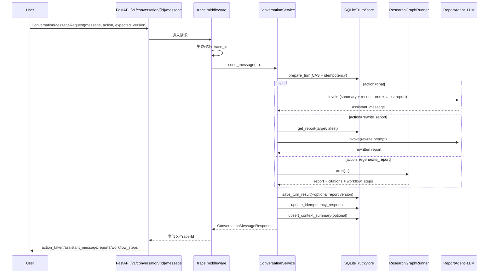

# 工程架构梳理

- 当前梳理时间: 2026-03-06 21:33:32

## 项目概览
- 项目定位: 面向加密市场研究场景的“对话优先”研报 Agent，支持“持续会话 -> 报告版本化 -> 可恢复回放”。
- 主要能力:
  - 基于标准 MCP 协议采集多源市场信号（`streamable_http` / `stdio` / `sse`），由官方 `langchain-mcp-adapters` 驱动。
  - MCP 采集按 server 拆分为并行 Agent 执行：多 MCP 配置会并发拉取信号并在节点内合并。
  - MCP Agent 对工具瞬时失败执行自动重试，并将运行期工具错误回传给模型，具备基础自修复能力。
  - 基于 LangGraph 编排主流程 9 节点，并输出节点级真实耗时 `workflow_steps`。
  - 会话统一入口支持 `auto/chat/rewrite_report/regenerate_report` 四种动作路由。
  - `from_turn_id` 提供真实分支语义：新 turn 通过 `parent_turn_id` 挂接到指定历史节点，并按该链路构建上下文。
  - 报告版本资产化（`conversation_report`）+ 会话轮次真相库（`conversation_turn`）+ 长会话摘要压缩（`conversation_context_summary`）。
  - 会话一致性采用“同会话单写者锁 + CAS version + request_id 幂等”保障并发安全与重试稳定。
  - 长期偏好由 DeepSeek 小模型自动抽取，写入前统一归一化并按规则合并为“单条画像”（watchlist 并集、risk/reading 覆盖）。
  - Milvus/Mem0 写入通过 outbox 异步投影，保证会话真相库强一致、外部记忆最终一致。
  - 提供 React 控制台前端，支持持续对话、回溯 turn、按 `parent_turn_id` 展示 Branch Tree、选择报告版本并继续改写/重跑。
- 关键输出:
  - `POST /v1/conversation/{conversation_id}/message`：统一对话入口，返回 `action_taken/assistant_message/report?/workflow_steps`。
  - `GET /v1/conversation/{conversation_id}/turns`、`GET /v1/conversation/{conversation_id}/turns/{turn_id}`：会话轮次回放（summary/detail 均含 `parent_turn_id`）。
  - `GET /v1/conversation/{conversation_id}/reports`、`GET /v1/conversation/{conversation_id}/reports/{report_id}`：报告版本回放。
  - `POST /v1/conversation/{conversation_id}/resume`：基于可选 `from_turn_id` 从历史分支继续执行下一轮 `regenerate_report`。
  - `POST /v1/research/query`：兼容入口，语义等价于 `regenerate_report`。
  - 所有请求通过中间件注入/透传 `X-Trace-Id` 响应头，便于端到端排障。

## 工程逻辑梳理

### 入口与启动
- 入口文件/命令:
  - 后端启动命令：`uv run python main.py`
  - 后端启动脚本：`main.py`，内部调用 `uvicorn.run("app.main:app", ...)`
  - FastAPI 应用入口：`app/main.py`
  - 前端启动命令：`npm --prefix frontend run dev`
  - 前端入口：`frontend/src/main.tsx`（`QueryClientProvider + BrowserRouter`）
- 启动流程概述:
  1. `main.py` 加载全局配置 `settings` 并启动 Uvicorn。
  2. FastAPI `lifespan` 中执行日志初始化 `setup_logging`。
  3. 构建 `AppRuntime`（`app/runtime.py`）统一装配依赖。
  4. `AppRuntime` 依次初始化：LangSmith、MilvusStore、SQLiteConversationTruthStore、LLM、SessionStore、MemoryService、MCPSignalSubgraphRunner、ResearchService、ReportAgent、ResearchGraphRunner、ConversationService、OutboxProjector。
  5. 请求进入后由 `trace_logging_middleware` 生成或透传 `X-Trace-Id`，记录请求开始/结束日志。
  6. 会话写路径先进入 `ConversationService`（CAS + 幂等 + 单会话串行），再按 action 分流到 chat/rewrite/regenerate。
  7. 应用关闭时执行 `runtime.close()`，依次停止 outbox 线程并释放 SessionStore/Milvus 连接。

### 核心模块
- 模块划分:
  - `app/api`: HTTP 路由与依赖注入。
  - `app/conversation`: 会话真相库、锁与幂等控制、对话路由、outbox 投影器。
  - `app/graph`: LangGraph 主流程（`workflow.py`）与 MCP Agent 执行器（`mcp_subgraph.py`）。
  - `app/retrieval`: Embedding、Milvus 双向量库封装（`signal_chunks` / `knowledge_chunks`）、信号入库与知识证据检索服务。
  - `app/memory`: 记忆服务（Mem0 优先，Milvus + Session 降级）与 SessionStore 抽象（memory/redis）。
  - `app/agents`: LLM 抽象、客户端工厂、研报生成代理。
  - `app/config`: 环境变量配置与日志配置（trace 上下文注入、按天+按大小轮转）。
  - `app/observability`: LangSmith 跟踪配置。
  - `app/models`: API 协议、内部信号模型、LangGraph State。
  - `frontend`: React 控制台（Dashboard / Memory / Ingest / Settings）。
  - `scripts`: 运维初始化、MCP 可用性验证、MCP 原始响应巡检、长期偏好画像修复脚本。
- 关键职责:
  - `app/main.py`: 应用创建、生命周期管理、请求级 trace middleware。
  - `app/runtime.py`: 统一装配运行时依赖，并启动 `OutboxProjector`。
  - `app/api/routes.py`: 暴露研究、会话消息、turn/report 查询、resume、记忆与入库接口。
  - `app/conversation/service.py`: 会话动作路由（auto/chat/rewrite/regenerate）、上下文拼装、摘要刷新。
  - `app/conversation/store.py`: snapshot/turn/report/summary/idempotency/event/outbox 的事务化读写。
  - `app/conversation/projector.py`: 消费 outbox 并异步投影到长期记忆写接口。
  - `app/graph/workflow.py`: 主流程 9 节点编排（load memory / resolve symbols / collect via MCP / normalize & index / retrieve knowledge evidence / analyze / generate / persist memory / finalize）。
  - `app/memory/mem0_service.py`: DeepSeek 偏好抽取、偏好归一化/合并、单条画像写回、recent turns + summary 注入、Mem0 platform/oss 兼容。
  - `app/retrieval/milvus_store.py`: 用户记忆 upsert/query、按 ID 批量删除、全量扫描（供离线修复脚本使用）。
  - `scripts/repair_user_memory_profile.py`: 离线修复历史 preference 冗余记录为单条画像结构（支持 `--dry-run`）。
  - `frontend/src/pages/DashboardPage.tsx`: Message Composer、Dialogue 流、Turn Timeline、Branch Tree（含“仅看当前锚点分支”过滤）、Report Version Tape。
- 主要依赖:
  - 后端: FastAPI/Uvicorn、LangGraph、LangChain、langchain-openai、langchain-mcp-adapters、tenacity、mcp、pymilvus、langchain-community（Zhipu embedding）、llama-index、mem0（可选）、redis（可选）。
  - 前端: React、Vite、TypeScript、TanStack Query、Zustand、React Router。

### 依赖关系
- 外部依赖:
  - LLM: MiniMax（默认，OpenAI-compatible）；可替换为任意 OpenAI-compatible 服务。
  - Embedding: 智谱 `embedding-3`（`ZhipuAIEmbeddings`，自动分批上限 64）。
  - 向量库: Milvus（不可用时按配置降级内存模式）。
  - 偏好抽取: DeepSeek OpenAI-compatible 接口（通过 `langchain-openai` `ChatOpenAI` 调用）。
  - 记忆增强: Mem0（可选；失败不阻断主流程，支持 `platform/oss`）。
  - Session Cache: Redis（可选；短期会话记忆缓存，失效不影响恢复真相库）。
  - MCP Servers: 由 `.mcp.json` 的 `mcpServers` 提供，支持 `http/stdio/sse`（内部映射为 `streamable_http/stdio/sse`）。
- 内部依赖:
  - API 层仅依赖 `AppRuntime`。
  - `ConversationService` 聚合 `ResearchGraphRunner + SQLiteConversationTruthStore + ConversationLockManager`。
  - `ResearchGraphRunner` 聚合 `MemoryService`、`MCPSignalSubgraphRunner`、`ResearchService`、`ReportAgent`。
  - `MemoryService` 同时依赖 `MilvusStore + SessionStore + ConversationTruthStore`。
  - `OutboxProjector` 轮询 `outbox_event` 并调用 `MemoryService.apply_*` 落地异步写。
  - 前端通过 `frontend/src/api/client.ts` 调用 `/v1/*`，默认由 Vite 代理到后端。

### 会话真相库与一致性
- 主要表结构:
  - `conversation_snapshot`：会话最新 `version/last_turn_id`。
  - `idempotency_request`：`request_id` 状态机（`pending/completed/failed`）。
  - `conversation_turn`：每轮完整记录（query/assistant_message/report/citations/errors/workflow/intent/turn_type/parent_turn_id/report_id）。
  - `conversation_report`：报告版本资产（`report_version` 会话内递增，支持 `based_on_report_id` 重写链）。
  - `conversation_context_summary`：长会话压缩摘要（`through_version` 指示覆盖边界）。
  - `conversation_event` + `outbox_event`：事件日志与异步投影队列。
  - `conversation_state_checkpoint`：节点级 checkpoint 预留。
- 并发与幂等规则:
  - 同 `conversation_id` 在进程内由 `ConversationLockManager` 串行写入。
  - `prepare_turn` 使用 `expected_version` 做 CAS；冲突返回 409。
  - `request_id` 重试命中 `idempotency_request` 缓存直接返回同结果。
  - turn 与幂等状态在同事务提交，避免“有版本无结果”或“重复写入”。
- 最终一致策略:
  - 会话结果（turn/report）以 SQLite truth store 为真相源。
  - Milvus/Mem0 写入走 outbox 后台线程重试，失败不会破坏会话历史可恢复性。

### 数据流/控制流
- 数据来源:
  - 用户消息（`message/action/task_context/expected_version/from_turn_id`）。
  - MCP tools 返回的结构化或文本内容。
  - 实时信号向量库（`signal_chunks`）、知识证据向量库（`knowledge_chunks`）、用户记忆（`user_memory`）以及会话真相库 turn/report/summary。
- 主链路（`POST /v1/conversation/{conversation_id}/message`）:
  1. API 路由接收消息并注入/透传 `trace_id`。
  2. `ConversationService.send_message` 执行 `prepare_turn`（CAS + 幂等 + version 分配）。
  3. 若提供 `from_turn_id`，将其作为分支锚点（父节点）；未提供时默认挂接当前最新 turn。
  4. `action=auto` 时优先调用 DeepSeek 小模型做 `chat/rewrite/regenerate` 动作分类；若模型不可用或分类失败，则回退到规则判断。
  5. `chat`：基于“分支摘要 + 分支最近 turns + 分支最新报告”构造 prompt，调用 LLM 生成对话回复。
  6. `rewrite_report`：优先读取目标报告；未指定时读取分支链路可见的最新报告并改写。
  7. `regenerate_report`：调用 `ResearchGraphRunner.arun` 执行完整 9 节点流程并产出新报告版本（透传分支锚点到记忆加载）。
  8. 报告记忆写回阶段会调用偏好抽取模型，仅保留可跨任务复用偏好字段并做脏数据过滤后再入库。
  9. 事务写入 `conversation_turn`，必要时写入 `conversation_report`，并更新 `idempotency_request=completed`。
  10. 刷新 `conversation_context_summary`（超过窗口后增量压缩历史轮次）。
- 兼容链路（`POST /v1/research/query`）:
  - 直接调用 `ConversationService.run_research_turn`，内部固定走 `regenerate_report` 路径并复用同一套一致性语义。
- 控制/调度流程:
  - 主调度引擎为 LangGraph `StateGraph`（线性 9 节点）。
  - MCP 采集由 `MCPSignalSubgraphRunner.arun` 一次执行完成；内部使用 `asyncio.gather` 并行调度各 server Agent。
  - 每个 server Agent 在 `create_agent` 上挂载工具调用中间层：瞬时失败自动重试，运行期工具错误以结构化 `ToolMessage` 回传给模型做参数修正或换工具。
  - `MCP_MAX_ROUNDS` 作为 Agent 的工具调用预算提示注入 prompt；工具是否调用由 LLM 按 query/symbols 自主决策。
  - 检索/报告生成通过 tenacity 重试；节点执行由 `_run_tracked_node` 统一记录耗时。

### 请求时序（`/v1/conversation/{conversation_id}/message`）

### 前端交互链路（`Dashboard`）
- `DashboardPage` 默认通过 `sendConversationMessage` 调用会话统一入口，不再局限单次 `query`。
- 页面采用四块主视图：`Message Composer`、`Dialogue`、`Timeline`、`Version Tape`。
- 支持 `action` 选择（auto/chat/rewrite/regenerate）、`expected_version` 回填、`from_turn_id` 分支续写。
- `Timeline` 上方新增 `Branch Tree`：基于 `parent_turn_id` 构建分支树，可一键设置 `from_turn_id` / `target_report_id`。
- `Branch Tree` 提供“仅看当前锚点分支”开关：当 `from_turn_id` 有效时仅展示锚点到祖先链路；未设置时回退全量树。
- 会话冲突（409）会解析 `conversation_version_conflict/request_in_flight` 并提示“按最新版本重试”。
- 报告区支持版本选择与回放，chat 场景下可只展示助手回复；报告仍支持 `<think>` 分离渲染。

### 关键配置
- 配置文件:
  - 环境变量入口：`.env`（示例见 `.env.example`）。
  - 配置对象：`app/config/settings.py` 中 `Settings.from_env()`。
- 关键参数:
  - 服务与观测：`APP_*`、`LOG_LEVEL`、`LOG_TO_FILE`、`LOG_FILE_*`、`LANGSMITH_*`。
  - LLM 可替换配置：`LLM_PROVIDER`、`LLM_MODEL`、`LLM_TEMPERATURE`、`LLM_TIMEOUT_SECONDS`、`MINIMAX_*`、`OPENAI_*`。
  - Embedding：`EMBEDDING_PROVIDER=zhipu`、`ZHIPU_EMBEDDING_MODEL`、`ZHIPU_EMBEDDING_BATCH_SIZE`、`ZHIPUAI_API_KEY`。
  - 向量库：`MILVUS_*`、`VECTOR_DIM`。
  - 记忆：`MEM0_ENABLED`、`MEM0_MODE`、`MEM0_OSS_COLLECTION`、`MEM0_API_KEY`、`MEM0_ORG_ID`、`MEM0_PROJECT_ID`。
  - 偏好抽取：`MEMORY_EXTRACTOR_MODEL`、`MEMORY_EXTRACTOR_TIMEOUT_SECONDS`、`DEEPSEEK_API_KEY`、`DEEPSEEK_BASE_URL`。
  - 会话持久化：`CONVERSATION_STORE_PATH`（SQLite 真相库路径）。
  - 短期会话缓存：`SESSION_STORE_BACKEND`（`memory|redis`）、`REDIS_URL`、`SESSION_MEMORY_TTL_SECONDS`、`SESSION_MEMORY_MAX_ITEMS`。
  - MCP: `MCP_CONFIG_PATH`（默认 `.mcp.json`，Claude Code 风格 `mcpServers`）、`MCP_MAX_ROUNDS`（Agent 工具调用预算提示）。
  - 报告合规：`REPORT_DISCLAIMER`（报告结尾免责声明文案）。
- 运行环境约束:
  - `VECTOR_DIM` 必须与 embedding 输出维度一致，否则写库前报错。
  - 智谱接口单次最多 64 条 input，已在 `BatchedZhipuAIEmbeddings` 中强制分批。
  - MCP 服务可达性受网络与工具参数影响，建议先执行验证脚本。
  - 若开启 Redis 会话缓存但依赖不可用，会自动回退内存缓存。
  - 若开启文件日志，运行账户需具备 `LOG_FILE_PATH` 父目录写权限。

### 运行流程
- 运行步骤:
  1. 配置 `.env`（至少填充 MiniMax、MCP、会话存储路径，可选 Zhipu/Mem0/Redis/DeepSeek 偏好抽取）。
  2. 执行 `uv run python scripts/init_milvus.py` 初始化集合。
  3. 可选执行 `uv run python scripts/verify_mcp_servers.py` 验证 MCP 可用性。
  4. 可选执行 `uv run python scripts/repair_user_memory_profile.py --dry-run` 预览历史偏好画像修复影响。
  5. 可选执行 `uv run python scripts/inspect_mcp.py` 生成 MCP 全量巡检报告（逐工具入参 + 原始响应）。
  6. 执行 `uv run python main.py` 启动后端并通过 `/docs` 调试。
  7. 执行 `npm --prefix frontend install && npm --prefix frontend run dev` 启动前端控制台。
- 异常/边界处理:
  - CAS 版本冲突返回 `409 conversation_version_conflict`，前端可刷新版本后重试。
  - 同一 `request_id` 处理中返回 `409 request_in_flight`；完成后重试会命中幂等缓存。
  - `rewrite_report` 在无可用报告版本时返回 404；`from_turn_id` 不存在时 resume/message 返回 404。
  - MCP 未配置或无工具可用时返回 `no_tools`，主流程走知识库证据 + 用户偏好降级生成报告。
  - MCP 工具瞬时失败会先自动重试；若仍失败，则将错误摘要作为 `ToolMessage` 回传给模型，由模型尝试修正参数或改用其他工具。
  - 非可重试错误（如权限、资源不存在、明显参数错误）不会无意义重试；失败摘要会进入 `errors`，并保留其他 server 的部分成功结果。
  - Agent 执行异常返回 `agent_failed`；若最终 JSON 解析失败但有 `ToolMessage` 可提取结果，仍会继续使用可提取信号。
  - Milvus 不可用时可降级内存存储（受 `MILVUS_ALLOW_FALLBACK` 控制）。
  - 未配置 LLM 密钥或 LLM 调用失败时，请求返回 500（硬失败）；未配置智谱密钥时降级哈希向量。
  - 未配置 `DEEPSEEK_API_KEY` 或抽取模型调用失败时，仅跳过偏好自动抽取，不影响主链路出报。
  - Mem0 初始化或调用失败仅告警，不阻断主流程。
- 观测与日志:
  - 日志由 `app/config/logging.py` 统一初始化，注入 `trace_id/task_id/user_id/component/round`。
  - API 层通过 `X-Trace-Id` 实现请求链路关联。
  - MCP 工具失败会记录 `tool/error_type/detail` 摘要，便于区分瞬时错误、参数错误与永久错误。
  - 会话层会记录 `turn.accepted/turn.completed/turn.failed` 事件，可用于恢复与排障。
  - outbox 投影器记录失败重试次数并在超阈值后标记 `failed`。
  - 文件日志支持“按天轮转 + 单文件超限切分 + 超期清理”。
  - LangSmith 通过 `configure_langsmith` 以环境变量控制开启。

## 改动概要/变更记录
### 2026-03-05 00:21:28
- 本次新增/更新要点:
  - 记忆链路新增 DeepSeek 偏好抽取模型配置（`MEMORY_EXTRACTOR_*`、`DEEPSEEK_*`），并在 `MemoryService` 中引入模型初始化与 JSON 结构化抽取流程。
  - 长期偏好写回升级为“单条画像”策略：写入前执行字段归一化（watchlist/risk_preference/reading_habit），并按“watchlist 并集、risk/reading 覆盖”进行合并。
  - Milvus 存储层新增 `delete_user_memory_by_ids` 与 `list_all_user_memory`，支撑清理历史 preference 冗余记录。
  - 新增 `scripts/repair_user_memory_profile.py` 离线修复脚本，可对历史数据进行 dry-run 预览与批量修复。
  - 单测补齐偏好抽取与合并行为，覆盖 LLM 输出合法/非法场景以及单条画像保持逻辑。
- 变更动机/需求来源:
  - 来源于当前会话需求：将 commit `53f560b38968481d7ddd8eb356c369007a19c936` 的能力变更同步到架构文档。
- 当前更新时间: 2026-03-05 00:21:28

### 2026-03-04 14:54:59
- 本次新增/更新要点:
  - 会话分支语义落地为“真分支”：`resume/message` 在 `from_turn_id` 场景下写入 `parent_turn_id`，并按该链路构建上下文；`rewrite_report` 未指定目标时读取分支可见最新报告。
  - 会话读取增强：`GET /v1/conversation/{id}/turns` 的 summary 增加 `parent_turn_id`，前端可直接构建分支树而无需逐条查询 detail。
  - 前端 Dashboard 新增 `Branch Tree` 与“仅看当前锚点分支”开关，支持围绕 `from_turn_id` 快速聚焦分支链路。
- 变更动机/需求来源:
  - 来源于当前会话需求：用户要求 `resume` 支持真实分支续写，并要求前端增加分支树与锚点分支过滤能力。
- 当前更新时间: 2026-03-04 14:54:59

### 2026-03-04 00:11:08
- 本次新增/更新要点:
  - 架构主入口从“单次 query”扩展为“会话消息驱动”：新增 `POST /v1/conversation/{conversation_id}/message`，支持 `auto/chat/rewrite_report/regenerate_report`。
  - 会话真相库新增报告版本与摘要压缩能力：`conversation_report`、`conversation_context_summary`，并补齐 turn 结构字段（`assistant_message/intent/turn_type/parent_turn_id/report_id`）。
  - 新增会话读取 API：`GET /v1/conversation/{id}`、`GET /v1/conversation/{id}/turns`、`GET /v1/conversation/{id}/turns/{turn_id}`、`GET /v1/conversation/{id}/reports`、`GET /v1/conversation/{id}/reports/{report_id}`，支持冷重启恢复与历史回放。
  - 运行时链路补充 `ConversationService + OutboxProjector + SessionStore`，明确“会话真相强一致、Milvus/Mem0 最终一致”的双写策略。
  - 前端 Dashboard 交互链路同步为持续对话模式：Message Composer + Dialogue + Timeline + Version Tape。
- 变更动机/需求来源:
  - 来源于当前会话需求：用户要求将“单次 query”重构为可持续对话，支持围绕首版研报继续交流，并在对话中触发改写/重跑报告。
- 当前更新时间: 2026-03-04 00:11:08

### 2026-03-03 16:30:35
- 本次新增/更新要点:
  - MCP 子图执行模型更新为“按 server 并行 Agent”：多 MCP 配置会拆分为多条并发 `create_agent(...).ainvoke(...)` 任务后统一归并。
  - 工具调用策略调整为“LLM 自主选择”：根据 query/symbols 选择相关工具，不再强制“每个 tool 至少调用一次”。
  - 数据流/时序说明同步更新：`discover_tools` 改为 `get_tools(server_name=...)`，并明确 server 级工具隔离与并行执行语义。
- 变更动机/需求来源:
  - 来源于当前会话需求：用户要求“3 个 MCP 在 mcp_subgraph 环节并行调用”，并进一步要求“取消每 tool 必调，改为 LLM 按 query 自行决定”。
- 当前更新时间: 2026-03-03 16:30:35

### 2026-03-03 14:02:56
- 本次新增/更新要点:
  - MCP 配置入口从 `MCP_SERVERS` JSON 数组切换为 Claude Code 风格 `.mcp.json`（`mcpServers`）。
  - 新增 `MCP_CONFIG_PATH`，用于指定 MCP 配置文件路径；默认读取项目根目录 `.mcp.json`。
  - 文档同步更新 MCP 配置语义：`http/stdio/sse` 对应内部 `streamable_http/stdio/sse`。
- 变更动机/需求来源:
  - 来源于当前会话需求：用户要求“重构 settings 与连接构建格式，不再使用 MCP_SERVERS 数组，采用更原生最佳实践”。
- 当前更新时间: 2026-03-03 14:02:56

### 2026-03-03 13:07:58
- 本次新增/更新要点:
  - 同步为 async-only MCP 调用链路描述：`MultiServerMCPClient.get_tools()` 与 `create_agent(...).ainvoke(...)`。
  - 修正主流程调用语义：`/v1/research/query` 时序更新为 `graph_runner.arun(...)`，并强调 `MCPSignalSubgraphRunner.arun`。
- 变更动机/需求来源:
  - 来源于当前会话需求：定位并修复 `StructuredTool does not support sync invocation` 的根因，避免同步 ToolNode 调用路径。
- 当前更新时间: 2026-03-03 13:07:58

### 2026-03-03 12:33:12
- 本次新增/更新要点:
  - 文档同步移除旧 `BaseLLMClient` 描述，统一为 LangChain 原生 `BaseChatModel` 客户端语义。
  - 更新 MCP Agent 执行链路示例：`create_agent` 入参由 `self.llm_client.llm` 修正为当前实现 `self.llm`。
- 变更动机/需求来源:
  - 来源于当前会话需求：用户要求“同步改掉”旧 LLM 抽象表述。
- 当前更新时间: 2026-03-06 21:33:32

### 2026-03-06 21:33:32
- 本次新增/更新要点:
  - 更新 README 与架构文档中的 MCP 自修复表述：统一为“基础自修复能力”，避免将能力描述成完整闭环自愈。
  - 补充 MCP Agent 工具失败处理机制：瞬时失败自动重试，运行期工具错误以结构化 `ToolMessage` 回传给模型做参数修正或换工具。
  - 更新异常与观测描述：补充非可重试错误不会重复死磕，并记录 `tool/error_type/detail` 便于排障。
- 变更动机/需求来源:
  - 来源于当前会话需求：用户要求同步最新 MCP 工具失败重试与错误回传逻辑到文档。
- 当前更新时间: 2026-03-06 21:33:32

### 2026-03-03 12:19:47
- 本次新增/更新要点:
  - 将 MCP 架构描述同步为 `create_agent` 版本：从“子图多轮规划+规则判停”更新为“工具发现 + Agent 自主调用 + 消息提取与结果归并”。
  - 更新数据流/控制流与时序图：新增 `create_agent` 执行阶段，移除旧 `mcp_plan/mcp_apply_rules/mcp_should_continue` 等子图节点描述。
  - 更新状态与配置语义：MCP 输出收敛为 `raw_signals/errors/mcp_tools_count/mcp_termination_reason`，`MCP_MAX_ROUNDS` 改为 Agent 工具调用预算提示。
  - 更新异常与观测描述：由旧判停/规则收敛语义改为 `agent_completed/no_tools/agent_failed` 与 `mcp.agent` 日志组件。
- 变更动机/需求来源:
  - 来源于当前会话需求：用户要求“同步更新到 create_agent 版本”。
- 当前更新时间: 2026-03-03 12:19:47

### 2026-03-03 11:27:02
- 本次新增/更新要点:
  - 按最新代码重写 MCP 架构描述：由旧 `MCPClient` 更新为 `MCPSignalSubgraphRunner + MultiServerMCPClient`，并补充“LLM 规划 + 规则引擎 + 判停”子图流程。
  - 更新运行时装配与依赖关系：`AppRuntime` 当前链路为 LLM/Memory/MCP 子图/Research/Report/GraphRunner。
  - 对齐配置项与约束：新增 `MCP_MAX_ROUNDS`、`MEM0_MODE(platform/oss)`、`ZHIPU_OPENAI_BASE_URL` 等当前实现字段。
  - 更新时序图与异常处理说明，明确子图判停原因与降级路径。
- 变更动机/需求来源:
  - 来源于当前会话需求：用户要求“根据最新代码更新 @docs/architecture.md”。
- 当前更新时间: 2026-03-03 11:27:02

### 2026-03-02 20:06:45
- 本次新增/更新要点:
  - 更新 MCP plan 现状：明确三层闭环（server 内重规划、server 级重试、graph 级纠错），并记录当前阈值 `SERVER_REPLAN_MAX_ROUNDS=2`、`SERVER_MAX_RETRY_ATTEMPTS=3`、`MCP_FEEDBACK_MAX_ROUNDS=2`。
  - 更新失败语义：server 异常会优先绑定最近一次工具上下文（`tool_name/arguments/reason`），用于下轮 planner 精准避坑。
  - 更新收敛策略：同工具后续成功时会折叠已修复的确定性失败与对应错误，避免“已修复问题”继续触发上层纠错重试。
- 变更动机/需求来源:
  - 来源于当前会话需求：用户要求把“当前 MCP plan 逻辑”同步到 `docs/architecture.md`。
- 当前更新时间: 2026-03-02 20:06:45

### 2026-03-02 18:45:10
- 本次新增/更新要点:
  - MCP 升级为 Agent 纠错闭环：第一轮确定性失败会进入 `failure_feedback`，触发同请求内的 LLM 二轮重规划。
  - 新增长期纠错记忆：将“失败参数 + 错误签名 + 修复后参数”写入 `tool_correction`，并在后续 MCP 规划前注入 `historical_corrections`。
  - 重试策略收敛：server 级重试不再对确定性参数/语义错误反复全量重放，仅对可恢复错误（如 5xx/429）重试。
  - 错误日志增强：`ExceptionGroup` 场景下也会提取并打印 `status_code/response_body`。
- 变更动机/需求来源:
  - 来源于当前会话需求：要求“报错进上下文让 LLM 自纠错，并把纠错行为沉淀为长期记忆”。
- 当前更新时间: 2026-03-02 18:45:10

### 2026-03-02 17:50:55
- 本次新增/更新要点:
  - 移除 MCP 工具规则预筛：`_select_tools` / `_score_tool` 及参数猜测逻辑从主链路删除，改为“候选工具全集 + LLM 选择 + LLM 生成参数”。
  - 增强规划鲁棒性：新增 planner 二次重试（首轮失败后携带校验错误与上次输出做自修复）。
  - 加强 schema 校验：新增 unknown argument 拦截，避免 LLM 生成不存在字段导致调用失败。
  - 同步测试覆盖：新增“非 JSON 输出后重试成功”“unknown argument 拒绝”用例。
- 变更动机/需求来源:
  - 来源于当前会话需求：继续落地“LLM 参与 MCP 工具选择+入参生成”，并移除规则引擎思路。
- 当前更新时间: 2026-03-02 17:50:55

### 2026-03-02 17:44:24
- 本次新增/更新要点:
  - MCP 采集主路径改为 LLM 规划：每个 server 在 `list_tools` 后由 LLM 生成 `calls`（工具名+arguments+reason）。
  - 新增参数校验链路：执行前按工具 `inputSchema` 做必填校验、基础类型转换与枚举校验，过滤无效调用。
  - 运行时装配调整：`MCPClient` 与 `ReportAgent` 共享同一个 LLM 客户端实例。
- 变更动机/需求来源:
  - 来源于当前会话需求：继续落地“LLM 参与 MCP 工具选择+入参生成”的主重构。
- 当前更新时间: 2026-03-02 17:44:24

### 2026-03-02 17:35:46
- 本次新增/更新要点:
  - 删除 LLM 规则引擎 fallback：`RuleBasedFallbackLLM` 已移除，LLM 客户端工厂改为严格配置校验。
  - 更新 LLM 初始化语义：当 `MINIMAX_API_KEY` 或 `OPENAI_*` 配置缺失时直接抛出异常，不再降级。
  - 补充测试覆盖：新增 LLM 工厂严格模式测试；新增 `LLM 不可用 -> /v1/research/query 返回 500` 的 API 测试。
- 变更动机/需求来源:
  - 来源于当前会话需求：用户要求重构时直接删除规则引擎 fallback，并明确 LLM 不可用时接口硬失败（500）。
- 当前更新时间: 2026-03-02 17:35:46

### 2026-03-02 16:57:27
- 本次新增/更新要点:
  - 更新 MCP 采集架构描述：工具选择从关键词粗筛升级为“意图 + symbol”规则评分，加入高噪声列表工具惩罚。
  - 更新错误语义：MCP `isError` 与调用异常统一并入 `errors`，日志中保留状态码/响应体等诊断信息，不再只保留异常类型。
  - 补充运维脚本：新增 `scripts/inspect_mcp.py`，用于逐工具落盘请求入参与原始响应，便于审计 MCP 可用数据面。
- 变更动机/需求来源:
  - 来源于当前会话需求：用户要求把“最近上下文中的 MCP 改动”同步到 `docs/architecture.md`。
- 当前更新时间: 2026-03-02 16:57:27

### 2026-03-02 13:24:31
- 本次新增/更新要点:
  - 对齐最新代码，补充 `workflow_steps` 节点执行轨迹输出、请求级 `X-Trace-Id` middleware 链路与日志上下文字段。
  - 更新 `/v1/research/query` 时序图，加入 `analyze_signals` 节点与 middleware 注入/回传流程。
  - 补充前端控制台架构（Dashboard/Memory/Ingest/Settings）与前后端调用关系。
  - 扩展配置与运行说明，纳入 `LOG_TO_FILE/LOG_FILE_*`、`REPORT_DISCLAIMER`、`MEM0_MODE` 等现行配置项。
- 变更动机/需求来源:
  - 来源于当前会话需求：用户要求“根据最新代码更新 @docs/architecture.md”。
- 当前更新时间: 2026-03-02 13:24:31

### 2026-03-01 22:50:56
- 本次新增/更新要点:
  - 补充 `/v1/research/query` 端到端请求时序图，明确 API、LangGraph、MCP、检索、LLM、记忆写回的调用顺序。
  - 顶部“当前梳理时间”更新为最新文档维护时间，便于与实现版本对齐。
- 变更动机/需求来源:
  - 来源于当前会话补充需求：用户要求在现有架构文档基础上继续完善。
- 当前更新时间: 2026-03-01 22:50:56

### 2026-03-01 22:48:28
- 本次新增/更新要点:
  - 新增 `docs/architecture.md`，基于当前代码真实结构补全入口、模块职责、依赖关系、数据流/控制流、关键配置与运行流程。
  - 明确记录近期架构调整：LLM provider 可替换、Embedding 固定智谱批处理、MCP 客户端标准化（`streamable_http/stdio/sse`）、旧 MCP 兼容配置移除。
  - 增加可运维说明：Milvus 初始化脚本与 MCP 服务器验证脚本的使用位置与目的。
- 变更动机/需求来源:
  - 来源于当前会话需求：用户要求使用 `architecture-doc-updater` 梳理工程架构并更新文档，使文档与最新实现保持一致。
- 当前更新时间: 2026-03-01 22:48:28
