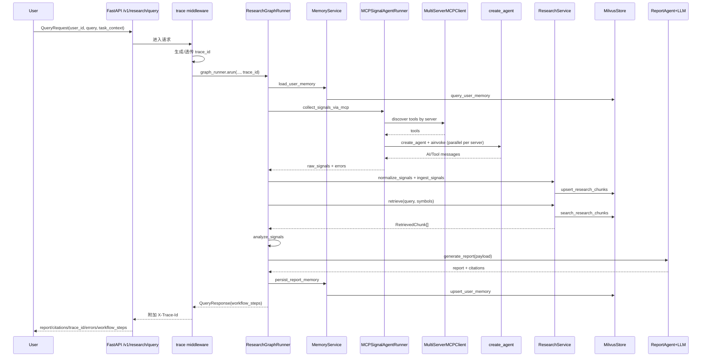

# 工程架构梳理

- 当前梳理时间: 2026-03-03 16:30:35

## 项目概览
- 项目定位: 面向加密市场研究场景的研报 Agent，聚焦“信号采集 -> 标准化 -> 检索增强 -> 个性化报告生成”。
- 主要能力:
  - 基于标准 MCP 协议采集多源市场信号（`streamable_http` / `stdio` / `sse`），由官方 `langchain-mcp-adapters` 驱动。
  - MCP 采集按 server 拆分为并行 Agent 执行：多 MCP 配置会并发拉取信号并在节点内合并。
  - 基于 LangGraph 编排主流程 9 节点，并输出节点级真实耗时 `workflow_steps`。
  - MCP 采集链路基于 `create_agent`：由 LLM 根据 query/symbols 自主选择工具，统一回收 `raw_signals/errors`。
  - 基于 Milvus 存储研究语料与用户记忆，支持向量检索与重排。
  - 基于 Mem0（可选，platform/oss 两种模式）+ 本地会话记忆形成长期/短期记忆画像。
  - LLM 客户端可配置替换（当前默认 MiniMax，走 OpenAI-compatible 协议）。
  - 提供 React 控制台前端，支持研报执行、记忆管理、手动入库、运行时状态查看。
- 关键输出:
  - `POST /v1/research/query` 返回 `report`、`citations`、`trace_id`、`errors`、`workflow_steps`。
  - `POST /v1/research/ingest` 支持外部文档回填为检索语料。
  - `POST /v1/user/preferences` / `GET /v1/user/profile/{user_id}` 支持偏好写入与画像读取。
  - 所有请求通过中间件注入/透传 `X-Trace-Id` 响应头，便于端到端排障。

## 工程逻辑梳理

### 入口与启动
- 入口文件/命令:
  - 后端启动命令：`uv run python main.py`
  - 后端启动脚本：`main.py`，内部调用 `uvicorn.run("app.main:app", ...)`
  - FastAPI 应用入口：`app/main.py`
  - 前端启动命令：`npm --prefix frontend run dev`
  - 前端入口：`frontend/src/main.tsx`（`QueryClientProvider + BrowserRouter`）
- 启动流程概述:
  1. `main.py` 加载全局配置 `settings` 并启动 Uvicorn。
  2. FastAPI `lifespan` 中执行日志初始化 `setup_logging`。
  3. 构建 `AppRuntime`（`app/runtime.py`）统一装配依赖。
  4. `AppRuntime` 依次初始化：LangSmith、MilvusStore、LLM Client、MemoryService、MCPSignalSubgraphRunner、ResearchService、ReportAgent、ResearchGraphRunner。
  5. 请求进入后由 `trace_logging_middleware` 生成或透传 `X-Trace-Id`，记录请求开始/结束日志。
  6. `collect_signals_via_mcp` 节点调用 `MCPSignalSubgraphRunner`，内部按 server 并行运行 `create_agent`，聚合每个 server 的工具调用结果。
  7. 应用关闭时执行 `runtime.close()`，释放 Milvus 连接。

### 核心模块
- 模块划分:
  - `app/api`: HTTP 路由与依赖注入。
  - `app/graph`: LangGraph 主流程（`workflow.py`）与 MCP Agent 执行器（`mcp_subgraph.py`）。
  - `app/retrieval`: Embedding、Milvus 存储封装、信号入库与检索服务。
  - `app/memory`: 记忆服务（Mem0 优先，Milvus + Session 降级）。
  - `app/agents`: LLM 抽象、客户端工厂、研报生成代理。
  - `app/config`: 环境变量配置与日志配置（trace 上下文注入、按天+按大小轮转）。
  - `app/observability`: LangSmith 跟踪配置。
  - `app/models`: API 协议、内部信号模型、LangGraph State。
  - `frontend`: React 控制台（Dashboard / Memory / Ingest / Settings）。
  - `scripts`: 运维初始化、MCP 可用性验证与 MCP 原始响应巡检脚本。
- 关键职责:
  - `app/main.py`: 应用创建、生命周期管理、请求级 trace middleware。
  - `app/runtime.py`: 统一装配运行时依赖，包含 MCP Agent Runner。
  - `app/api/routes.py`: 暴露 4 个核心接口并触发运行时服务。
  - `app/graph/workflow.py`: 主流程 9 节点编排（load memory / resolve symbols / collect via MCP / normalize & index / retrieve / analyze / generate / persist memory / finalize），并记录 `workflow_steps`。
  - `app/graph/mcp_subgraph.py`: MCP 采集执行器，负责按 server 发现工具、并行 `create_agent` 调用、ToolMessage 提取与最终 JSON 结果合并。
  - `app/retrieval/research_service.py`: 信号标准化、切块、嵌入、写库、召回重排。
  - `app/memory/mem0_service.py`: 偏好写回、画像聚合、长期/短期记忆边界控制、Mem0 platform/oss 兼容。
  - `app/agents/report_agent.py`: Prompt 组织、报告生成、引用抽取、免责声明附加。
  - `frontend/src/pages/DashboardPage.tsx`: 查询执行、工作流可视化、报告渲染与引用展示。
- 主要依赖:
  - 后端: FastAPI/Uvicorn、LangGraph、LangChain、langchain-openai、langchain-mcp-adapters、tenacity、mcp、pymilvus、langchain-community（Zhipu embedding）、llama-index、mem0（可选）。
  - 前端: React、Vite、TypeScript、TanStack Query、Zustand、React Router。

### 依赖关系
- 外部依赖:
  - LLM: MiniMax（默认，OpenAI-compatible）；可替换为任意 OpenAI-compatible 服务。
  - Embedding: 智谱 `embedding-3`（`ZhipuAIEmbeddings`，自动分批上限 64）。
  - 向量库: Milvus（不可用时按配置降级内存模式）。
  - 记忆增强: Mem0（可选；失败不阻断主流程，支持 `platform/oss`）。
  - MCP Servers: 由 `.mcp.json` 的 `mcpServers` 提供，支持 `http/stdio/sse`（内部映射为 `streamable_http/stdio/sse`）。
- 内部依赖:
  - API 层仅依赖 `AppRuntime`。
  - `ResearchGraphRunner` 聚合 `MemoryService`、`MCPSignalSubgraphRunner`、`ResearchService`、`ReportAgent`。
  - `MCPSignalSubgraphRunner` 依赖 LangChain 原生 `BaseChatModel` + `MultiServerMCPClient` + `create_agent`；按 server 隔离工具集并并行执行 Agent 后统一归并结果。
  - `ResearchService` 与 `MemoryService` 共同依赖 `MilvusStore` 与 embedding 工具。
  - 前端通过 `frontend/src/api/client.ts` 调用 `/v1/*`，默认由 Vite 代理到后端。

### 数据流/控制流
- 数据来源:
  - 用户请求（query/task_context/user_id）。
  - MCP tools 返回的结构化或文本内容。
  - 历史研究语料（`research_chunks`）与用户记忆（`user_memory`）。
- 数据处理链路:
  1. `POST /v1/research/query` 进入 middleware，注入/透传 `trace_id`。
  2. API 路由进入 `ResearchGraphRunner.arun`，初始化 `task_id` 与状态。
  3. `load_user_memory` 聚合长期/短期记忆并补充可选 Mem0 搜索结果。
  4. `resolve_symbols` 按优先级解析 symbols（`task_context` > `query`），并将 watchlist 仅作为 MCP 软提示。
  5. `collect_signals_via_mcp` 调用 MCP Agent 执行器，执行以下阶段：
     - `discover_tools_by_server`: 通过 `MultiServerMCPClient.get_tools(server_name=...)` 分 server 拉取可用工具并构建目录。
     - `run_agents_in_parallel`: 对每个 server 使用 `create_agent(model=self.llm, tools=server_tools)` 并通过 `await agent.ainvoke(...)` 并行执行。
     - `extract_rows`: 从各 server Agent 的 `ToolMessage`（`content/artifact.structured_content`）抽取原始项并标准化。
     - `merge_payload`: 解析各 server Agent 最后一条 AI JSON（`raw_signals/errors`），与工具提取结果去重合并。
     - `finalize`: 返回 `raw_signals/errors/mcp_tools_count/mcp_termination_reason` 给主流程。
  6. `normalize_and_index` 标准化为 `NormalizedSignal`，切块并写入 Milvus。
  7. `retrieve_context` 做向量召回 + 重排（时间衰减/来源可信度/语义分）。
  8. `analyze_signals` 汇总信号覆盖、类型分布、平均置信度。
  9. `generate_report` 组织 Prompt 调用可替换 LLM，生成研报与 citations。
  10. `persist_memory` 抽取可复用偏好写回长期记忆。
  11. `finalize_response` 汇总报告、引用、错误及 `workflow_steps` 并返回 API。
- 控制/调度流程:
  - 主调度引擎为 LangGraph `StateGraph`（线性 9 节点）。
  - MCP 采集由 `MCPSignalSubgraphRunner.arun` 一次执行完成；内部使用 `asyncio.gather` 并行调度各 server Agent。
  - `MCP_MAX_ROUNDS` 当前作为 Agent 的工具调用预算提示注入 prompt；工具是否调用由 LLM 按 query/symbols 自主决策，不强制全量工具调用。
  - 主流程关键调用通过 tenacity 重试：检索（最多 2 次）、报告生成（最多 3 次）。
  - 每个主节点通过 `_run_tracked_node` 记录 `status/duration_ms`，返回前端脉冲轨道。
  - MCP 终止语义简化为：`agent_completed`、`no_tools`、`agent_failed`。

### 请求时序（`/v1/research/query`）

### 前端交互链路（`Dashboard`）
- `DashboardPage` 将用户输入组装为 `QueryRequest` 并调用 `queryResearch`。
- 返回后把 `workflow_steps` 映射到 `BASE_WORKFLOW`，展示 9 节点状态与耗时。
- 报告渲染支持基础 Markdown（标题、列表、代码块、表格、引用块）。
- 若报告包含 `<think>...</think>`，前端会拆分显示“推理草稿”和“正式报告”。

### 关键配置
- 配置文件:
  - 环境变量入口：`.env`（示例见 `.env.example`）。
  - 配置对象：`app/config/settings.py` 中 `Settings.from_env()`。
- 关键参数:
  - 服务与观测：`APP_*`、`LOG_LEVEL`、`LOG_TO_FILE`、`LOG_FILE_*`、`LANGSMITH_*`。
  - LLM 可替换配置：`LLM_PROVIDER`、`LLM_MODEL`、`LLM_TEMPERATURE`、`LLM_TIMEOUT_SECONDS`、`MINIMAX_*`、`OPENAI_*`。
  - Embedding：`EMBEDDING_PROVIDER=zhipu`、`ZHIPU_EMBEDDING_MODEL`、`ZHIPU_EMBEDDING_BATCH_SIZE`、`ZHIPUAI_API_KEY`。
  - 向量库：`MILVUS_*`、`VECTOR_DIM`。
  - 记忆：`MEM0_ENABLED`、`MEM0_MODE`、`MEM0_OSS_COLLECTION`、`MEM0_API_KEY`、`MEM0_ORG_ID`、`MEM0_PROJECT_ID`、`ZHIPU_OPENAI_BASE_URL`。
  - MCP: `MCP_CONFIG_PATH`（默认 `.mcp.json`，Claude Code 风格 `mcpServers`）、`MCP_MAX_ROUNDS`（Agent 工具调用预算提示）。
  - 报告合规：`REPORT_DISCLAIMER`（报告结尾免责声明文案）。
- 运行环境约束:
  - `VECTOR_DIM` 必须与 embedding 输出维度一致，否则写库前报错。
  - 智谱接口单次最多 64 条 input，已在 `BatchedZhipuAIEmbeddings` 中强制分批。
  - MCP 服务可达性受网络与工具参数影响，建议先执行验证脚本。
  - 若开启文件日志，运行账户需具备 `LOG_FILE_PATH` 父目录写权限。

### 运行流程
- 运行步骤:
  1. 配置 `.env`（至少填充 MiniMax、MCP、可选 Zhipu/Mem0 凭据）。
  2. 执行 `uv run python scripts/init_milvus.py` 初始化集合。
  3. 可选执行 `uv run python scripts/verify_mcp_servers.py` 验证 MCP 可用性。
  4. 可选执行 `uv run python scripts/inspect_mcp.py` 生成 MCP 全量巡检报告（逐工具入参 + 原始响应）。
  5. 执行 `uv run python main.py` 启动后端并通过 `/docs` 调试。
  6. 执行 `npm --prefix frontend install && npm --prefix frontend run dev` 启动前端控制台。
- 异常/边界处理:
  - MCP 未配置或无工具可用时返回 `no_tools`，主流程走历史检索降级生成报告。
  - Agent 执行异常返回 `agent_failed`；若最终 JSON 解析失败但有 ToolMessage 提取结果，仍会继续使用可提取信号。
  - Milvus 不可用时可降级内存存储（受 `MILVUS_ALLOW_FALLBACK` 控制）。
  - 未配置 LLM 密钥或 LLM 调用失败时，`/v1/research/query` 直接返回 500（硬失败）；未配置智谱密钥时降级哈希向量。
  - Mem0 初始化或调用失败仅告警，不阻断主流程。
- 观测与日志:
  - 日志由 `app/config/logging.py` 统一初始化，注入 `trace_id/task_id/user_id/component/round`。
  - API 层通过 `X-Trace-Id` 实现请求链路关联。
  - MCP 采集在 `mcp.agent` 组件记录工具数与信号数，便于定位 Agent 工具调用质量。
  - 文件日志支持“按天轮转 + 单文件超限切分 + 超期清理”。
  - LangSmith 通过 `configure_langsmith` 以环境变量控制开启。

## 改动概要/变更记录
### 2026-03-03 16:30:35
- 本次新增/更新要点:
  - MCP 子图执行模型更新为“按 server 并行 Agent”：多 MCP 配置会拆分为多条并发 `create_agent(...).ainvoke(...)` 任务后统一归并。
  - 工具调用策略调整为“LLM 自主选择”：根据 query/symbols 选择相关工具，不再强制“每个 tool 至少调用一次”。
  - 数据流/时序说明同步更新：`discover_tools` 改为 `get_tools(server_name=...)`，并明确 server 级工具隔离与并行执行语义。
- 变更动机/需求来源:
  - 来源于当前会话需求：用户要求“3 个 MCP 在 mcp_subgraph 环节并行调用”，并进一步要求“取消每 tool 必调，改为 LLM 按 query 自行决定”。
- 当前更新时间: 2026-03-03 16:30:35

### 2026-03-03 14:02:56
- 本次新增/更新要点:
  - MCP 配置入口从 `MCP_SERVERS` JSON 数组切换为 Claude Code 风格 `.mcp.json`（`mcpServers`）。
  - 新增 `MCP_CONFIG_PATH`，用于指定 MCP 配置文件路径；默认读取项目根目录 `.mcp.json`。
  - 文档同步更新 MCP 配置语义：`http/stdio/sse` 对应内部 `streamable_http/stdio/sse`。
- 变更动机/需求来源:
  - 来源于当前会话需求：用户要求“重构 settings 与连接构建格式，不再使用 MCP_SERVERS 数组，采用更原生最佳实践”。
- 当前更新时间: 2026-03-03 14:02:56

### 2026-03-03 13:07:58
- 本次新增/更新要点:
  - 同步为 async-only MCP 调用链路描述：`MultiServerMCPClient.get_tools()` 与 `create_agent(...).ainvoke(...)`。
  - 修正主流程调用语义：`/v1/research/query` 时序更新为 `graph_runner.arun(...)`，并强调 `MCPSignalSubgraphRunner.arun`。
- 变更动机/需求来源:
  - 来源于当前会话需求：定位并修复 `StructuredTool does not support sync invocation` 的根因，避免同步 ToolNode 调用路径。
- 当前更新时间: 2026-03-03 13:07:58

### 2026-03-03 12:33:12
- 本次新增/更新要点:
  - 文档同步移除旧 `BaseLLMClient` 描述，统一为 LangChain 原生 `BaseChatModel` 客户端语义。
  - 更新 MCP Agent 执行链路示例：`create_agent` 入参由 `self.llm_client.llm` 修正为当前实现 `self.llm`。
- 变更动机/需求来源:
  - 来源于当前会话需求：用户要求“同步改掉”旧 LLM 抽象表述。
- 当前更新时间: 2026-03-03 12:33:12

### 2026-03-03 12:19:47
- 本次新增/更新要点:
  - 将 MCP 架构描述同步为 `create_agent` 版本：从“子图多轮规划+规则判停”更新为“工具发现 + Agent 自主调用 + 消息提取与结果归并”。
  - 更新数据流/控制流与时序图：新增 `create_agent` 执行阶段，移除旧 `mcp_plan/mcp_apply_rules/mcp_should_continue` 等子图节点描述。
  - 更新状态与配置语义：MCP 输出收敛为 `raw_signals/errors/mcp_tools_count/mcp_termination_reason`，`MCP_MAX_ROUNDS` 改为 Agent 工具调用预算提示。
  - 更新异常与观测描述：由旧判停/规则收敛语义改为 `agent_completed/no_tools/agent_failed` 与 `mcp.agent` 日志组件。
- 变更动机/需求来源:
  - 来源于当前会话需求：用户要求“同步更新到 create_agent 版本”。
- 当前更新时间: 2026-03-03 12:19:47

### 2026-03-03 11:27:02
- 本次新增/更新要点:
  - 按最新代码重写 MCP 架构描述：由旧 `MCPClient` 更新为 `MCPSignalSubgraphRunner + MultiServerMCPClient`，并补充“LLM 规划 + 规则引擎 + 判停”子图流程。
  - 更新运行时装配与依赖关系：`AppRuntime` 当前链路为 LLM/Memory/MCP 子图/Research/Report/GraphRunner。
  - 对齐配置项与约束：新增 `MCP_MAX_ROUNDS`、`MEM0_MODE(platform/oss)`、`ZHIPU_OPENAI_BASE_URL` 等当前实现字段。
  - 更新时序图与异常处理说明，明确子图判停原因与降级路径。
- 变更动机/需求来源:
  - 来源于当前会话需求：用户要求“根据最新代码更新 @docs/architecture.md”。
- 当前更新时间: 2026-03-03 11:27:02

### 2026-03-02 20:06:45
- 本次新增/更新要点:
  - 更新 MCP plan 现状：明确三层闭环（server 内重规划、server 级重试、graph 级纠错），并记录当前阈值 `SERVER_REPLAN_MAX_ROUNDS=2`、`SERVER_MAX_RETRY_ATTEMPTS=3`、`MCP_FEEDBACK_MAX_ROUNDS=2`。
  - 更新失败语义：server 异常会优先绑定最近一次工具上下文（`tool_name/arguments/reason`），用于下轮 planner 精准避坑。
  - 更新收敛策略：同工具后续成功时会折叠已修复的确定性失败与对应错误，避免“已修复问题”继续触发上层纠错重试。
- 变更动机/需求来源:
  - 来源于当前会话需求：用户要求把“当前 MCP plan 逻辑”同步到 `docs/architecture.md`。
- 当前更新时间: 2026-03-02 20:06:45

### 2026-03-02 18:45:10
- 本次新增/更新要点:
  - MCP 升级为 Agent 纠错闭环：第一轮确定性失败会进入 `failure_feedback`，触发同请求内的 LLM 二轮重规划。
  - 新增长期纠错记忆：将“失败参数 + 错误签名 + 修复后参数”写入 `tool_correction`，并在后续 MCP 规划前注入 `historical_corrections`。
  - 重试策略收敛：server 级重试不再对确定性参数/语义错误反复全量重放，仅对可恢复错误（如 5xx/429）重试。
  - 错误日志增强：`ExceptionGroup` 场景下也会提取并打印 `status_code/response_body`。
- 变更动机/需求来源:
  - 来源于当前会话需求：要求“报错进上下文让 LLM 自纠错，并把纠错行为沉淀为长期记忆”。
- 当前更新时间: 2026-03-02 18:45:10

### 2026-03-02 17:50:55
- 本次新增/更新要点:
  - 移除 MCP 工具规则预筛：`_select_tools` / `_score_tool` 及参数猜测逻辑从主链路删除，改为“候选工具全集 + LLM 选择 + LLM 生成参数”。
  - 增强规划鲁棒性：新增 planner 二次重试（首轮失败后携带校验错误与上次输出做自修复）。
  - 加强 schema 校验：新增 unknown argument 拦截，避免 LLM 生成不存在字段导致调用失败。
  - 同步测试覆盖：新增“非 JSON 输出后重试成功”“unknown argument 拒绝”用例。
- 变更动机/需求来源:
  - 来源于当前会话需求：继续落地“LLM 参与 MCP 工具选择+入参生成”，并移除规则引擎思路。
- 当前更新时间: 2026-03-02 17:50:55

### 2026-03-02 17:44:24
- 本次新增/更新要点:
  - MCP 采集主路径改为 LLM 规划：每个 server 在 `list_tools` 后由 LLM 生成 `calls`（工具名+arguments+reason）。
  - 新增参数校验链路：执行前按工具 `inputSchema` 做必填校验、基础类型转换与枚举校验，过滤无效调用。
  - 运行时装配调整：`MCPClient` 与 `ReportAgent` 共享同一个 LLM 客户端实例。
- 变更动机/需求来源:
  - 来源于当前会话需求：继续落地“LLM 参与 MCP 工具选择+入参生成”的主重构。
- 当前更新时间: 2026-03-02 17:44:24

### 2026-03-02 17:35:46
- 本次新增/更新要点:
  - 删除 LLM 规则引擎 fallback：`RuleBasedFallbackLLM` 已移除，LLM 客户端工厂改为严格配置校验。
  - 更新 LLM 初始化语义：当 `MINIMAX_API_KEY` 或 `OPENAI_*` 配置缺失时直接抛出异常，不再降级。
  - 补充测试覆盖：新增 LLM 工厂严格模式测试；新增 `LLM 不可用 -> /v1/research/query 返回 500` 的 API 测试。
- 变更动机/需求来源:
  - 来源于当前会话需求：用户要求重构时直接删除规则引擎 fallback，并明确 LLM 不可用时接口硬失败（500）。
- 当前更新时间: 2026-03-02 17:35:46

### 2026-03-02 16:57:27
- 本次新增/更新要点:
  - 更新 MCP 采集架构描述：工具选择从关键词粗筛升级为“意图 + symbol”规则评分，加入高噪声列表工具惩罚。
  - 更新错误语义：MCP `isError` 与调用异常统一并入 `errors`，日志中保留状态码/响应体等诊断信息，不再只保留异常类型。
  - 补充运维脚本：新增 `scripts/inspect_mcp.py`，用于逐工具落盘请求入参与原始响应，便于审计 MCP 可用数据面。
- 变更动机/需求来源:
  - 来源于当前会话需求：用户要求把“最近上下文中的 MCP 改动”同步到 `docs/architecture.md`。
- 当前更新时间: 2026-03-02 16:57:27

### 2026-03-02 13:24:31
- 本次新增/更新要点:
  - 对齐最新代码，补充 `workflow_steps` 节点执行轨迹输出、请求级 `X-Trace-Id` middleware 链路与日志上下文字段。
  - 更新 `/v1/research/query` 时序图，加入 `analyze_signals` 节点与 middleware 注入/回传流程。
  - 补充前端控制台架构（Dashboard/Memory/Ingest/Settings）与前后端调用关系。
  - 扩展配置与运行说明，纳入 `LOG_TO_FILE/LOG_FILE_*`、`REPORT_DISCLAIMER`、`MEM0_MODE` 等现行配置项。
- 变更动机/需求来源:
  - 来源于当前会话需求：用户要求“根据最新代码更新 @docs/architecture.md”。
- 当前更新时间: 2026-03-02 13:24:31

### 2026-03-01 22:50:56
- 本次新增/更新要点:
  - 补充 `/v1/research/query` 端到端请求时序图，明确 API、LangGraph、MCP、检索、LLM、记忆写回的调用顺序。
  - 顶部“当前梳理时间”更新为最新文档维护时间，便于与实现版本对齐。
- 变更动机/需求来源:
  - 来源于当前会话补充需求：用户要求在现有架构文档基础上继续完善。
- 当前更新时间: 2026-03-01 22:50:56

### 2026-03-01 22:48:28
- 本次新增/更新要点:
  - 新增 `docs/architecture.md`，基于当前代码真实结构补全入口、模块职责、依赖关系、数据流/控制流、关键配置与运行流程。
  - 明确记录近期架构调整：LLM provider 可替换、Embedding 固定智谱批处理、MCP 客户端标准化（`streamable_http/stdio/sse`）、旧 MCP 兼容配置移除。
  - 增加可运维说明：Milvus 初始化脚本与 MCP 服务器验证脚本的使用位置与目的。
- 变更动机/需求来源:
  - 来源于当前会话需求：用户要求使用 `architecture-doc-updater` 梳理工程架构并更新文档，使文档与最新实现保持一致。
- 当前更新时间: 2026-03-01 22:48:28
