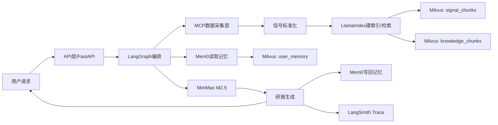

# 加密市场信号研报 Agent 设计文档

## 1. 文档信息
- 版本：v1.1
- 状态：可开发
- 更新时间：2026-03-01
- 目标：为用户提供可记忆偏好的加密市场信号研报能力

---

## 2. 需求确认（已明确）
本项目需要构建一个面向用户的研报 Agent，满足以下约束：

1. 聚焦“加密市场信号收集 + 研究报告生成”。
2. 可记住用户的研究偏好、关注标的、阅读习惯、任务上下文。
3. 固定技术栈：LangChain、LangGraph、Mem0、LlamaIndex。
4. 向量数据库：Milvus（本地 Docker 已部署，直接对接）。
5. 容错：使用 tenacity 处理 Agent 调用失败重试。
6. 可观测：使用 LangSmith 做链路追踪。
7. LLM 固定为：MiniMax M2.5。
8. 第一阶段仅开发“可通过 MCP 获取”的数据源；不能通过 MCP 获取的来源先不开发。
9. 包管理使用 uv，由开发者手动执行 `uv add` 安装。
10. 代码需有完善中文注释，便于开发者快速上手。

---

## 3. 产品目标

1. 将多源市场信息（新闻/社媒/链上/行情）转化为结构化信号。
2. 对用户“长期偏好 + 短期任务上下文”做记忆与个性化输出。
3. 生成可读、可追溯、可复用的研报。
4. 支持任务式研究（例如每日固定时段输出 BTC/ETH 风险信号报告）。

---

## 4. 总体架构



### 4.1 分层说明
- 接入层：接收用户查询、任务上下文、用户身份信息。
- 编排层：LangGraph 管理节点流程、分支和失败重试。
- 记忆层：Mem0 管理长期记忆与会话记忆。
- 检索层：LlamaIndex 负责切分、向量化、召回、重排。
- 存储层：Milvus 存实时信号、知识证据与用户记忆。
- 模型层：MiniMax M2.5 负责分析与生成。
- 观测层：LangSmith 跟踪链路和节点行为。

---

## 5. 技术选型与职责

- LangChain：工具封装、Prompt 管理、模型调用抽象。
- LangGraph：Agent 状态机与可控编排。
- Mem0：用户长期偏好记忆管理。
- LlamaIndex：知识入库、检索增强（RAG）。
- Milvus：向量存储与相似检索。
- 智谱 Embedding（`embedding-3`）：文本向量化，供 Milvus 检索使用。
- tenacity：失败重试、退避与熔断辅助。
- LangSmith：运行追踪、调试与评估。
- MiniMax M2.5：核心推理与生成模型。

---

## 6. 多源市场信息采集设计（V1：仅 MCP）

## 6.1 结论
- V1 仅支持可通过 MCP 工具直接获取的数据源。
- 非 MCP 数据源（例如独立爬虫、WebSocket 原生采集、强反爬站点）本阶段不实现。

## 6.2 数据源接入范围（V1）
纳入条件：必须满足“有可用 MCP tool + 返回稳定结构化数据”。

可纳入示例：
1. 交易所公开 REST 类型信息（行情、资金费率、持仓等）
2. 新闻 / RSS / 官方公告
3. 链上聚合指标 API
4. 其他可稳定通过 MCP 获取的结构化数据

## 6.3 暂不开发（进入 Backlog）
1. 逐笔/盘口 WebSocket 高频流
2. 强反爬、动态渲染网页抓取
3. 登录态、复杂签名的数据源
4. 独立 Direct API/Crawler 旁路方案

## 6.4 采集链路
1. LangGraph 节点触发采集任务。
2. 使用标准 MCP 客户端（支持 `streamable_http / stdio / sse`）调用工具获取原始数据。
3. 标准化映射为统一信号结构。
4. 落库 Milvus（研究语料）并生成可检索 chunk。
5. 失败场景走 tenacity 重试；重试失败后降级返回“数据不足说明”。

## 6.5 V1 推荐 MCP Servers（已验证可用）
1. `coingecko`（`https://mcp.api.coingecko.com/mcp`）
   - 能力：行情、币种、趋势与部分链上指标。
2. `defillama`（`https://mcpllama.com/mcp`）
   - 能力：链上 TVL、协议维度数据。
3. `cryptonews`（stdio：`uvx cryptonewsmcp`）
   - 能力：加密新闻 RSS 聚合（如 CoinDesk/Decrypt）。

---

## 7. 信号标准化模型

统一字段（建议）：
- `timestamp`：信号时间（UTC）
- `symbol`：标的（BTC/ETH/SOL...）
- `source`：来源标识
- `signal_type`：`price | news | sentiment | onchain`
- `value`：原始值或抽取结果
- `confidence`：置信度（0~1）
- `raw_ref`：原文引用或来源链接
- `ingest_mode`：固定 `mcp`
- `task_id`：任务链路 ID

---

## 8. 记忆系统设计（Mem0 + Milvus）

## 8.1 记忆类型

### 长期记忆（Persistent）
- 研究偏好（宏观/短线/链上驱动）
- 关注标的（watchlist）
- 风险偏好（保守/均衡/激进）
- 阅读习惯（摘要优先/深度优先/格式偏好）

### 短期记忆（Session/Task）
- 当前任务目标
- 本轮检索到的关键证据
- 中间推理结论和待验证假设

## 8.2 写回原则
1. 回答后抽取“可长期复用偏好”写入 Mem0。
2. 一次性任务上下文默认写入短期记忆。
3. 冲突偏好采用“时间戳 + 置信度”覆盖策略。

---

## 9. 检索增强设计（LlamaIndex + Milvus）

1. 文档入库：按来源进行清洗、切块、嵌入、写入 `knowledge_chunks`。
2. 查询重写：结合用户偏好和任务上下文生成检索查询。
3. 多路召回：关键词过滤 + 向量相似检索。
4. 重排策略：时间衰减 + 来源可信度 + 语义相关度。
5. 输出要求：研报必须附带引用来源。

## 9.1 Embedding 策略（V1 固定智谱）
1. 使用 `langchain_community.embeddings.ZhipuAIEmbeddings`。
2. 模型固定默认 `embedding-3`（可通过环境变量覆盖）。
3. 批处理使用 `batch_size=64`，并强制单次请求最多 64 条输入。
4. 通过环境变量注入 `ZHIPUAI_API_KEY`。
5. `VECTOR_DIM` 必须与所选 embedding 模型输出维度一致，否则拒绝写入并报错。

---

## 10. Agent 工作流（LangGraph）

## 10.1 状态对象（State）
- `user_id`
- `query`
- `task_context`
- `memory_profile`
- `signals`
- `knowledge_docs`
- `report_draft`
- `final_report`
- `citations`
- `errors`
- `trace_id`

## 10.2 节点定义
1. `load_user_memory`：加载长期偏好与会话上下文。
2. `resolve_symbols`：解析本次任务标的（硬路由）并生成 MCP 软提示标的集合。
3. `collect_signals_via_mcp`：通过 MCP 拉取信号源数据。
4. `normalize_and_index`：标准化并入库/建索引。
5. `retrieve_knowledge_evidence`：检索知识库背景证据。
6. `analyze_signals`：评估强弱、方向与冲突证据。
7. `generate_report`：生成结构化研报。
8. `persist_memory`：写回长期可复用记忆。
9. `finalize_response`：输出报告、引用、trace。

## 10.3 失败处理
- 采集失败：重试 -> 降级说明。
- 检索不足：放宽检索条件重试一次。
- 生成失败：重试生成并保留中间错误记录。

---

## 11. Milvus 数据模型

## 11.1 Collection: `signal_chunks`
- `id` (primary key)
- `doc_id`
- `chunk_id`
- `symbol`
- `source`
- `published_at`
- `embedding` (vector)
- `text`

## 11.2 Collection: `knowledge_chunks`
- `id` (primary key)
- `doc_id`
- `chunk_id`
- `symbol`
- `source`
- `published_at`
- `embedding` (vector)
- `text`
- `metadata` (json)

索引建议：
- 向量索引：HNSW（初期）
- 标量过滤字段：`symbol`、`source`、`published_at`

## 11.2 Collection: `user_memory`
- `id` (primary key)
- `user_id`
- `memory_type`（preference/watchlist/habit/context）
- `content`
- `embedding`
- `confidence`
- `updated_at`

---

## 12. 重试与稳定性（tenacity）

## 12.1 重试范围
- MCP 工具调用
- MiniMax 模型调用
- Milvus 查询/写入
- 关键节点内部网络请求

## 12.2 建议策略
- `stop_after_attempt(3)`
- `wait_exponential(multiplier=1, min=1, max=16)`
- 按异常类型决定是否重试（超时、连接失败、限流）
- 所有写操作保证幂等键，避免重复写入

---

## 13. 可观测性（LangSmith）

## 13.1 追踪字段
- `trace_id`
- `user_id`
- `task_id`
- `graph_node`
- `latency_ms`
- `token_usage`
- `retrieval_hit_count`
- `retry_count`
- `error_type`

## 13.2 监控目标
- 端到端平均时延
- 节点失败率
- 重试成功率
- 检索命中率
- 报告生成成功率

---

## 14. API 设计（建议）

1. `POST /v1/research/query`
   - 入参：`user_id`, `query`, `task_context?`
   - 出参：`report`, `citations`, `trace_id`

2. `POST /v1/user/preferences`
   - 入参：用户偏好设置
   - 出参：保存结果

3. `GET /v1/user/profile/{user_id}`
   - 出参：聚合记忆画像

4. `POST /v1/knowledge/documents`
   - 入参：知识库文档正文与元信息
   - 出参：知识库入库结果

---

## 15. 代码注释规范（中文，强制）

## 15.1 注释目标
- 让新开发者快速理解“为什么这样设计”。
- 明确边界条件、失败处理、降级策略。

## 15.2 必须覆盖位置
1. 模块头：模块职责、输入输出、关键依赖。
2. 类定义：业务语义、状态字段。
3. 函数：参数、返回、异常、副作用。
4. 核心分支：重试、降级、幂等、回退路径。
5. 数据模型：字段含义、取值范围、默认策略。

## 15.3 特别要求
- LangGraph 节点函数必须写明：节点目标、前置条件、状态产出。
- tenacity 装饰器附近必须注明：重试触发条件与停止条件。
- Mem0 写回逻辑必须注明：长期记忆与短期记忆的判定规则。

---

## 16. 安全与合规

1. 所有密钥通过环境变量注入，不入库不入日志。
2. 用户数据按 `user_id` 隔离。
3. 日志脱敏（凭证、隐私内容）。
4. 报告增加免责声明：仅供研究，不构成投资建议。

---

## 17. 项目结构建议

```text
crypto-signal-agent/
  app/
    api/
    graph/
    agents/
    memory/
    retrieval/
    tools/
    models/
    observability/
    config/
  scripts/
  tests/
  docs/
    design.md
  pyproject.toml
```

---

## 18. 依赖安装（uv add，由开发者手动执行）

> 说明：MiniMax M2.5 按 OpenAI-compatible 方式接入。

```bash
uv add langchain langgraph llama-index mem0ai pymilvus tenacity langsmith pydantic python-dotenv fastapi "uvicorn[standard]" httpx
uv add llama-index-vector-stores-milvus
uv add langchain-openai openai
uv add langchain-community zhipuai
uv add mcp
```

---

## 19. 分阶段实施计划（V1）

1. 工程初始化与配置（环境变量、日志、LangSmith）。
2. 建立 Milvus collections 与索引。
3. 接入 Mem0 读写链路。
4. 实现 MCP 采集工具封装与标准化映射。
5. 搭建 LlamaIndex 入库/检索管线。
6. 实现 LangGraph 主流程节点。
7. 接入 MiniMax M2.5 推理与报告生成。
8. 加入 tenacity 重试与降级逻辑。
9. 完成 API 联调与端到端测试。
10. 文档完善（运行手册、排障手册）。

---

## 20. 验收标准（V1）

1. 能基于 MCP 数据源输出结构化研报。
2. 能记住并复用用户偏好（跨会话生效）。
3. 研报包含引用来源与风险提示。
4. 节点失败可重试并记录到 LangSmith。
5. 代码中文注释覆盖核心模块，开发者可快速接手。

---

## 21. Backlog（V1 不开发）

1. 非 MCP 数据源采集（Direct API / 爬虫 / WebSocket）。
2. 更细粒度实时流处理与告警系统。
3. 自动化任务编排与多租户权限体系。
